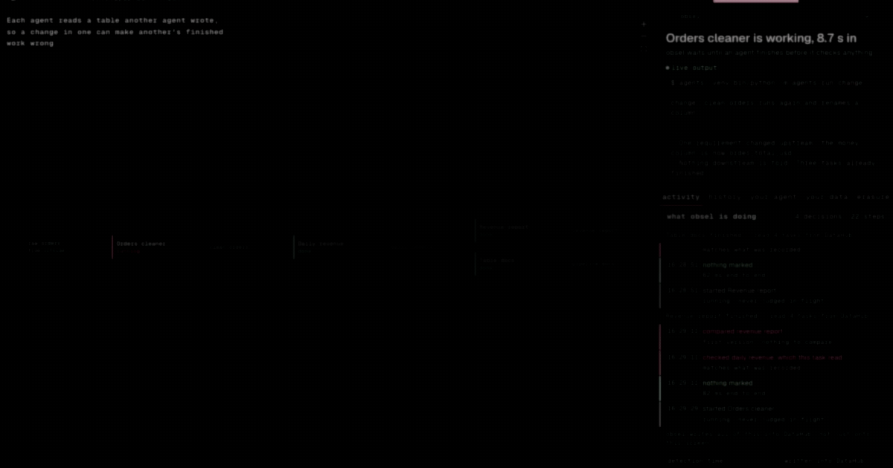
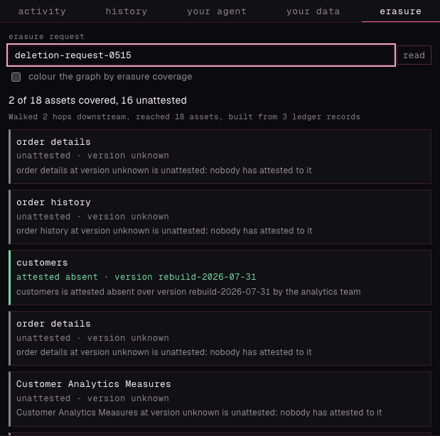
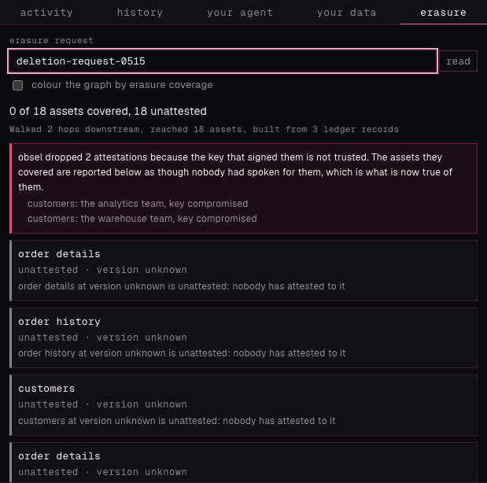

<div align="center">



**obsel tracks a right-to-erasure request across the systems it cannot see: every asset the request
reaches stays unattested until an operator who can look signs for it.**

**It also tells you which finished agent work is now based on data that has changed since it ran.**

Built for [Build with DataHub: The Agent Hackathon](https://datahub.devpost.com/) &nbsp;·&nbsp;
Category: _Agents That Do Real Work_ &nbsp;·&nbsp; Apache-2.0

[Verify it in your browser](https://bayshores.github.io/obsel/) &nbsp;·&nbsp;
[Try it](#try-it) &nbsp;·&nbsp; [Bring your own agent](#bring-your-own-agent) &nbsp;·&nbsp;
[Check the claims](#check-the-claims-yourself) &nbsp;·&nbsp; [Commands](#commands) &nbsp;·&nbsp;
[Docs](#more-reading)

</div>

---

## Erasure coverage

A GDPR Article 17 erasure request arrives, a team deletes the subject's rows in the system it owns,
and the request is closed. Nobody can say where else those rows had already flowed, or which of
those places anybody has looked at.

obsel starts from the tables known to hold the subject and walks lineage: the Consumes and Produces
edges between jobs and tables that DataHub's ingestion already records for the estate. Every asset
that walk reaches starts at `UNPROVEN`, which says nobody has spoken for that asset, not that the
subject is still in it.

An asset leaves `UNPROVEN` only on an attestation: a statement signed with a registered Ed25519 key
by the operator of the store holding the asset, binding the subject's absence to a named version of
a named table. obsel holds no warehouse credentials and reads no warehouse data. It cannot prove
absence itself and does not claim to. It composes those local claims into a per-asset picture no
single attestor is positioned to produce, and leads its report with the assets nobody signed for.

Coverage is what that report totals across the walk, derived from the append-only ledger of signed
records on every read and never stored. The vocabulary is fixed, in the code and in every document
here:

| Never say    | Say                                          |
| ------------ | -------------------------------------------- |
| proven clean | attested absent over version V by attestor A |
| proof        | evidence, attestation                        |
| complete     | N of M assets covered, K unattested          |

The rules that decide what an attestation is worth:

- An attestation binds to a **version**, never a content hash. A rewrite that produced identical
  bytes reopens the asset, because nobody has attested to the new version.
- A run that merged, appended or rewrote three of 730 partitions **cannot** account for what it left
  behind, and is never accepted as a rebuild.
- An attestor declares what it consumed, and obsel cross-checks that against DataHub's recorded
  lineage, so leaving out an unclean upstream is detectable.
- If the key that signed an attestation is later reported compromised, the asset goes back to
  unattested, though no data changed. A stored verdict would still be reporting the old number,
  because a compromise report touches no table and no stored field.
- **No route, tool or argument marks an asset covered.** A live test asserts those endpoints do not
  exist.

The rule, and the ten counterexamples it was checked against, are in
[`docs/erasure-coverage.md`](docs/erasure-coverage.md). It was written before the code, because two
earlier drafts of the rule were unsound.

The same walk answers a second question, about finished work rather than about people. The rest of
this page is that half.

## The problem

Agents in a swarm read tables that other agents wrote.

When an agent changes a table, any downstream work that already finished is now based on data that
is no longer current. Nothing reports this, so the finished work still looks complete.

## What obsel does

Every agent task becomes a real DataJob in DataHub, wired into that same lineage by the tables it
reads and the tables it writes, so the graph itself is the coordination: obsel runs no message bus
and no scheduler. When an output changes, obsel follows those edges and flags every finished
downstream task, recording the reason and the change that caused it. That includes tasks that never
read the changed table directly, only something built on it. The same cascade raises one native
DataHub Incident on the table that changed, listing every flagged task. The incident comes down
when the marks it names are gone: cleared by redone work, or wiped with the whole board on a
reset. No route or tool resolves one directly.

A re-run that produces the same table flags nothing. If identical re-runs raised flags, users would
learn to ignore every flag.

## When you should not use this

If one orchestrator owns your pipeline, it can already do this and you should use it instead.
[Dagster](https://docs.dagster.io/guides/build/assets/asset-versioning-and-caching) marks an asset
stale when its upstream data changed and it has not re-run since, and propagates that downstream.
[dbt](https://docs.getdbt.com/docs/deploy/state-aware-about) rebuilds a model when a source has new
data.

obsel is for the case those tools do not cover. No single tool owns the graph. Agents from different
frameworks, on different machines, join and leave, with no shared scheduler to ask. Both tools
above need every node declared in a project before it can take part; an agent joins obsel at runtime
by announcing itself, and creates its own node when it does.

The full comparison, including where obsel is genuinely not novel, is in
[docs/concept.md](docs/concept.md#3a-orchestrators-checked-properly-on-2026-07-23).

---

## What it looks like

|                                                                                                        Everything is fine                                                                                                        |                                                                                                                                                   Something changed upstream                                                                                                                                                   |
| :------------------------------------------------------------------------------------------------------------------------------------------------------------------------------------------------------------------------------: | :----------------------------------------------------------------------------------------------------------------------------------------------------------------------------------------------------------------------------------------------------------------------------------------------------------------------------: |
| [](docs/images/settled.png) | [](docs/images/flagged.png) |
|                                                                        Four agents finished. Nothing they read has changed since, so obsel flags nothing.                                                                        |                                                                                                         One column was renamed. Three finished agents are now out of date, and **two of them never read that table**.                                                                                                          |

<div align="center"><em>Click either image for full size.</em></div>

Both came out of one run on 2026-07-30, from commit `8a09994`, against a live DataHub and a live
Codex CLI. Not mockups, and not assembled from separate sessions.

| What happened                                       | Measured                                             |
| --------------------------------------------------- | ---------------------------------------------------- |
| Four agents did the work                            | 117.4 s of real Codex sessions                       |
| One agent's instructions changed                    | `order_total` became `order_total_usd`               |
| obsel called it a column change, not a value change | the content hash was `539b509722e8` before and after |
| Three finished agents flagged                       | 402 ms, one at one hop and two at two                |
| Written back into DataHub                           | 3 of 3                                               |

### Recordings

The full three-minute demo, [on YouTube](https://youtu.be/LhOvqAJ96Zw), is cut from recordings of
real runs. It follows the forty-agent run, the mid-swarm change and the repair end to end, then
closes on a real erasure request opened against a real catalog. Its report on camera reads 2 of 18
assets covered and 16 unattested, and then both signing keys are reported compromised and the same
report reads 0 of 18 covered and 18 unattested. The two clips below are from a separate four-agent
take.

|                                                                                 The change is detected                                                                                  |                                                                                              The repair                                                                                              |
| :-------------------------------------------------------------------------------------------------------------------------------------------------------------------------------------: | :--------------------------------------------------------------------------------------------------------------------------------------------------------------------------------------------------: |
|  |  |
|                                                                        Three flags landed in a measured 397 ms.                                                                         |                                          A redo of **one** of the three flagged tasks took 28.3 s, and obsel took the other two flags off itself in 233 ms.                                          |

Both clips come from one sequence, recorded 2026-07-30 against the same live stack, with that run's
own numbers in frame. Those two came off because the redone table came out identical, which is the
only way a flag ever clears. There is no button that dismisses one. Either the flagged task re-runs
and reports, or an upstream task re-runs, its table comes back identical, and obsel clears the
downstream flags that redo restores.

The film's last twelve seconds are the erasure report, and these are the two states it passes
through, from that same recording on 2026-08-09.

|                                                                                   The coverage report                                                                                    |                                                                                                  After the keys are reported compromised                                                                                                   |
| :--------------------------------------------------------------------------------------------------------------------------------------------------------------------------------------: | :----------------------------------------------------------------------------------------------------------------------------------------------------------------------------------------------------------------------------------------: |
|  |  |
|                                                                     2 of 18 covered, each by a different team's key.                                                                     |                                                                                      0 of 18, 3.8 s later. No asset was written and no version moved.                                                                                      |

"Identical" is the fingerprint's word, not the file system's. Rows are sorted before hashing, and
any column the task registered as volatile is left out. Two tables that differ only in row order, or
only in a load timestamp declared at registration, are identical to obsel and to every sentence
about identical output in these documents. Nothing else is excluded.

---

## Try it

**Nothing to install:
[bayshores.github.io/obsel](https://bayshores.github.io/obsel/)** holds a real evidence bundle from a
live run and re-checks it in your browser, including the signatures. Seven buttons edit one field of
it each — flip a byte of a signature, report the signing key compromised, replay a record, edit
obsel's own answer — and the check runs again on the edit. The page shows what changed and what the
refusal was. It is running `attestation.ts`, `erasure.ts` and
`scripts/verify-erasure-evidence.mjs` from this repository, not a recording of them.

That page is the erasure half without a stack. For the whole thing, including staleness and the
agents, run it locally.

Start Docker Desktop, then download this repository and **double-click `scripts/Start obsel.command`**.

A terminal window opens and works down nine steps, saying what it is doing. You do not type
anything. It starts DataHub, installs what is missing, registers obsel's tag, starts the app, and
opens the page in your browser. Anything it cannot do for you, such as installing Docker or signing
in to your agent CLI, it names, along with the next step to take.

On Linux, and on macOS if you would rather not double-click a file:

```bash
bash scripts/start.sh
```

Windows is not covered by the launcher. Use WSL and the command above, or the video and
[`examples/`](examples/) without running anything.

The same setup by hand is three commands, and the app guides the rest:

```bash
datahub docker quickstart
cp .env.example .env.local
pnpm install && pnpm dev
```

Open **`http://localhost:3000`**.

The page opens on a checklist, because those three commands are not quite everything. The demo
agents need their own Python packages and a signed-in agent CLI, and obsel needs its tag registered
in DataHub. Every item is checked on your machine a couple of times a second, finished ones are
ticked, and anything missing shows you the exact command to run. Work down the list until it is
empty. The launcher above does the same work in the same order, because two of those steps only
work once DataHub is answering.

**One thing you type in**, and the checklist asks for it like the rest. Every route that changes
something needs a bearer token. `.env.local` holds it, `scripts/start.sh` generates one there if it
is empty, and the page has a field at the top of its panel to paste it into. Paste it once and the
browser keeps it. The server never hands it to the page, because anyone who can load the page could
then read it. The agents skip this step, because obsel spawns them and they inherit the token from
its environment.

```bash
grep OBSEL_API_TOKEN .env.local
```

After that, the demo runs from five buttons.

| Button                                       | What happens                                                                                  |
| -------------------------------------------- | --------------------------------------------------------------------------------------------- |
| **Run the demo agents**                      | Four agents are declared in DataHub, then four real agent sessions do the work.               |
| **Run the orders cleaner again, no changes** | The same table comes out, so nothing should go out of date. obsel flags nothing.              |
| **Change one agent's instructions**          | A column gets renamed. Three finished agents go amber, and two of them never read that table. |
| **Redo the work obsel flagged**              | Agents redo it in order. A redo that lands identical clears the flags on work built on it.    |
| **Reset and start over**                     | Everything goes back to up to date. The agents stay set up.                                   |

Redoing the work removes the flags, so after a full pass the board shows nothing out of date. The
**history** tab keeps the record, one entry per decision obsel made, written into DataHub, saying
what changed, what was flagged, and what a redo closed. Only a completion can write to it, and
nothing reads it back to decide anything.

### What you need

| Thing                               | Why                                                                                          |
| ----------------------------------- | -------------------------------------------------------------------------------------------- |
| Node 24 and pnpm 11                 | the app                                                                                      |
| Docker                              | the local DataHub stack                                                                      |
| Python 3                            | the demo agents, which get their own environment                                             |
| `uv`                                | obsel writes its tag through DataHub's own MCP server                                        |
| Codex CLI or Claude Code, signed in | each agent is a real session of one of them, so there is no offline mode and no API key path |

**Either agent CLI will do, and you need only one.** With nothing set, obsel uses whichever is
installed and prefers Codex when both are. To pick, set `OBSEL_RUNNER=codex` or `OBSEL_RUNNER=claude`
before starting. Claude Code sessions are pinned to `claude-sonnet-5` at medium effort and are
allowed to run `python3`, which they need to execute the transformation they write;
[`docs/setup.md`](docs/setup.md) says what that permission does and does not cover. The setup checklist, the launcher and the workers all read it, so they cannot
disagree about which product is doing the work. An agent reporting through MCP names its own runner
rather than being asked, because the runner is the agent's business, not obsel's. obsel records what
a client declared itself to be and does not claim to have checked it. Most measured numbers below
were taken against Codex; the forty-task pipeline has also been run end to end on Claude Code once,
recorded in [`docs/verification.md`](docs/verification.md).

The launcher installs `uv` if it is missing, and skips whatever is already done, so running it twice
is safe. Docker, Node and the agent CLI sign-in need you, so it detects those and says what to do. It
installs DataHub `v1.5.0.6` by name. The measured numbers through 2026-08-02 were taken against
that version; the 2026-08-09 runs, including the erasure evidence bundle and the incident
measurements, ran against `v1.7.0`, and `docs/verification.md` names the stack beside each run.

obsel shows one page at a time. The page's header carries its name, and opening that name explains
how to start obsel on a different one.

Every step written out in full, with a way to tell each one worked, is in
**[`docs/setup.md`](docs/setup.md)**.

### If something goes wrong

| What you see                                                             | What to do                                                                                                                               |
| ------------------------------------------------------------------------ | ---------------------------------------------------------------------------------------------------------------------------------------- |
| macOS refuses to open the file, or warns about an unidentified developer | Right-click `scripts/Start obsel.command`, choose Open, then Open again. Or run `bash scripts/start.sh`, which no such check applies to. |
| Double-clicking opens the file in a text editor                          | Run `bash scripts/start.sh` in a terminal instead.                                                                                       |
| "Docker is installed but not running"                                    | Open Docker Desktop and wait for its icon to settle, then start the launcher again.                                                      |
| DataHub takes a very long time on the first run                          | Expected. It downloads several large images. Give Docker Desktop at least 8 GB in Settings, Resources.                                   |
| "obsel needs Node 24"                                                    | Install Node 24 from nodejs.org. The launcher will not run the app on an older one, because Next.js 16 does not support it.              |
| Port 3000 or 8080 already in use                                         | Something else on your machine has it. Stop that, then start the launcher again.                                                         |
| The page shows a checklist with items still missing                      | That is the launcher handing over. Each item says what to run, and ticks itself when done.                                               |

---

## Bring your own agent

obsel is both an MCP client and an MCP server. It uses DataHub's MCP server to write its tag, and it
runs one of its own, so any MCP-capable agent can join a swarm.

```bash
claude mcp add obsel -- "$PWD/agents/.venv/bin/python" -m agents.mcp_server
```

The panel beside the graph shows this same command with your machine's paths filled in, plus a
four-step checklist that ticks itself off as obsel sees your agent declare itself, announce, report,
and get its first answer. The checklist is derived from the swarm rather than stored, so driving
your agent from a terminal ticks it just the same.

| Tool                                                       | What your agent uses it for                                                        |
| ---------------------------------------------------------- | ---------------------------------------------------------------------------------- |
| `check_freshness(reads)`                                   | before working: are my inputs still trustworthy?                                   |
| `register_task(name, reads, writes, title?, ...)`          | say what I read and what I write, once                                             |
| `announce_start(taskUrn)`                                  | before writing, so work in flight is never flagged                                 |
| `report_complete(taskUrn, outputs, inputs?, runner?, ms?)` | what I produced; obsel replies with what that broke, and with what it proved sound |
| `abandon_task(taskUrn)`                                    | hand the announcement back if I failed                                             |
| `read_board()`                                             | who else is in the swarm, and how they are doing                                   |
| `rerun_plan()`                                             | when work is flagged, what to redo and in what order                               |
| `erasure_board(request, scope?)`                           | what an erasure request still has nobody speaking for, as work to do               |
| `request_challenge(request, asset)`                        | the one-time value my attestation must be signed over                              |
| `submit_attestation(request, envelope)`                    | hand over a signed claim; obsel verifies it or refuses it with every reason        |

Reporting a table is one line: `{"clean_orders": {"path": "data/clean_orders.json"}}`. obsel reads
and hashes the file itself, so no rows travel through the tool call.

Passing `inputs` the same way lets obsel cross-check reads against writes. It compares what your
agent read against what the writer recorded. If they disagree, that table was changed by something
that never reported, and every finished task built on the old version gets flagged, with the reason
saying the change was never reported.

Two things your agent deliberately cannot do:

- **It never hashes its own output.** `report_complete` takes a file path or the real rows, and
  obsel hashes them itself. An agent that could hand obsel a hash could hand it the _previous_ hash
  and be believed.
- **It cannot flag or unflag anything.** A flag comes off through redone work and nothing else.
  The flagged task itself re-runs and reports, or a flagged upstream task re-runs and its table
  comes back identical, and obsel clears the flags that redo provably restores. The reply's
  `restored` list is how your agent finds out the second thing happened. It cannot ask for it.

[`skills/obsel-collaboration/SKILL.md`](skills/obsel-collaboration/SKILL.md) documents the order of
operations an agent must follow for obsel's answers to be correct. Copy it into `.claude/skills/` to
install it.

### Bring your own data

The same MCP tools work for your own files, in a few minutes. Register a task that reads your file
and one that builds on it, report both, change the file, and the downstream task gets flagged with
the reason. In a real run on 2026-07-24, with a five-row expenses CSV, a renamed column flagged
the totals task at 1 hop in a measured 3934 ms, and the redo cleared it. The copy-paste walkthrough,
with every reply quoted from that run, is in [`docs/setup.md`](docs/setup.md). The full matrix of
shapes, changes and edge cases obsel has been run against is
[`docs/coverage.md`](docs/coverage.md).

Where your tables are already documented in DataHub, the optional step 4b in
[`docs/setup.md`](docs/setup.md) reads that documentation through DataHub's Agent Context Kit and puts
the description and the columns into each agent's prompt as a delimited section marked as data rather
than instructions; it adds nothing for the four demo tables, which obsel registers without a
description or a schema.

**Declaring those tasks is a form on the page**, under the joining panel, with a name and the
tables it reads and writes. It posts to the same `/api/tasks/register` the MCP tool calls, so a
task you add by hand and a task an agent registered itself are the same entity and appear in the
same list.

**Reporting the work is a table on the page too.** Open a task you registered and write its table
by hand. The columns are chips you can rename, drop or add, and the rows are cells you can type
into. Press report and obsel hashes what you handed it and answers with what it invalidated. That
is the whole loop without an agent CLI and without a terminal, in about fifteen seconds, and every
call is the same one an agent would make. The browser never computes a fingerprint. The button posts
to `/api/tasks/report`, which runs `agents/report.py`, which calls the same
`mcp_core.completion_body` the MCP server uses. A second implementation of the fingerprint could
disagree with the first about whether a table changed.

Neither the page nor an agent can hand obsel a hash, and no button clears a flag. This route is
token-gated like every other mutation, and it was not always. It runs `agents/report.py`, which
completes the task with the server's own token, so while it was open
anyone who could reach the port could replay a flagged task's old rows and have the completion read
as an identical redo that cleared the flag. [`docs/architecture.md`](docs/architecture.md) records
the whole of it.

---

## Check the claims yourself

Each row is one command, and names the file that would fail if the claim were false.

| Claim                                                                    | Run                                | Where it lives                                                                             |
| ------------------------------------------------------------------------ | ---------------------------------- | ------------------------------------------------------------------------------------------ |
| A re-run producing the same table flags nothing                          | `pnpm test`                        | `tests/staleness.test.ts`, where about half the tests assert no action                     |
| Same again, through a real DataHub and through MCP                       | `pnpm test:live`                   | `engine.live.test.ts`, `obsel-mcp.live.test.ts`                                            |
| A change reaches work that never read the table that changed             | `pnpm test:live`                   | `obsel-mcp.live.test.ts` checks one hop and two, each with its reason                      |
| Work in flight is never flagged                                          | `pnpm test`                        | `tests/staleness.test.ts`                                                                  |
| A flagged task's identical redo clears the flags downstream of it        | `pnpm test:live`                   | `engine.live.test.ts`, and over real stdio in `obsel-mcp.live.test.ts`                     |
| That clearing refuses everything it cannot prove                         | `pnpm test`                        | `tests/staleness.test.ts`: the refusal cases come first, each guard checked by breaking it |
| The `obsel-stale` tag really lands in DataHub, confirmed by reading back | `pnpm test:live`                   | `mcp.live.test.ts`, `obsel-mcp.live.test.ts`                                               |
| A cascade raises one DataHub Incident, resolved only by the real repair  | `pnpm test:live`                   | `incidents.live.test.ts`, including the routes and tools that do not exist                 |
| `217` and `217.0` are not treated as a change                            | `python3 -m agents.worker`         | and again through MCP in `agents/mcp_core.py`                                              |
| A reply obsel never sent is refused, not read as "nothing was affected"  | `python3 -m agents.run self-check` | breaking that guard fails six checks, and five more in `mcp_core.py`                       |
| Any MCP agent can join and set off a real chain of flags                 | `pnpm test:live`                   | `obsel-mcp.live.test.ts`, with a real client, a dead port, and the wrong server            |
| TypeScript and Python build identical DataHub ids                        | `pnpm test`                        | `tests/urns.test.ts` runs the Python module for real                                       |

**Nothing here is tested against a stand-in.** Anything that crosses a process boundary is covered
against a live DataHub, the real MCP server, a real obsel, and a real session of each agent CLI
installed.

Verify the committed evidence bundle with Node and nothing else:

```bash
node scripts/verify-erasure-evidence.mjs examples/erasure-evidence/bundle.json
```

That file is a real capture: 18 assets reached, 2 signed attestations, 2 of 18 covered. The script
re-runs obsel's own signature check and coverage kernel over the bytes and exits 0 only if the
answer obsel recorded is the one the evidence supports. Edit any signature, key status or lineage
edge in it and the script exits 1 naming the record and what failed. Details in
[`examples/erasure-evidence/`](examples/erasure-evidence/).

### What is still open

The full record of what has been measured, and what has not, is in
**[`docs/verification.md`](docs/verification.md)**. The short version:

- The demo has passed cleanly seven times, on one machine. That is not a pass rate.
- The agents are live models, and their output has needed pinning down three times.
- Detection times are single observations, not a benchmark, and most forty-task figures are one or
  two observations each.
- The graph has been checked in a real browser on two pipeline shapes, four tasks and forty, plus
  a joined fifth agent in the unit suite. Nothing between or beyond those.
- The submission video is cut, rendered and [on YouTube](https://youtu.be/LhOvqAJ96Zw) (2:59.9,
  3840x2160 at 25 fps), made from recordings of real runs against a real DataHub. It has no
  narration, by choice, and its production project is not committed here.
- **Bringing your own data is half on the page.** Declaring tasks is a form, driven against a real
  DataHub on 2026-07-26. Reporting a file is not. obsel takes the fingerprint from rows itself, and
  doing that in the browser would be a second definition of what counts as a change, so the report
  still comes from whatever runs your work.
- **The erasure half has a page, and no workflow behind it.** The board's erasure tab takes a
  request id and shows the coverage report, a state and a sentence for every asset the walk
  reached, how many are covered and how many nobody has attested to, and the same graph recolored
  by coverage. One request has been run end to end against a real catalog on 2026-07-26, covering
  23 assets over five platforms, one turned attested by a real Ed25519 signature. What is missing is
  everything around it. Opening a request is a curl command. No agent drives the tab on its own.
  The attestations in those runs were signed by the operator, not routed to the owner of each
  asset and waited for, and nothing binds an attestation to a version obsel derived from the
  warehouse itself, for the reason the erasure section states.

---

## Commands

```bash
pnpm dev         # the page at http://localhost:3000
pnpm verify      # format, lint, typecheck, tests, Python self-checks, build
pnpm test        # pure logic only, no Docker
pnpm test:live   # against live services; needs DataHub up, uvx, and an agent CLI on PATH
pnpm e2e         # browser checks; builds and serves the app itself
pnpm site:build  # the hosted verifier, into site/dist
```

**`pnpm verify` is the one to run first.** It needs no Docker and no browser download.

As of 2026-08-10, `pnpm verify` passes end to end, with 658 unit tests across 38 files and 235
Python self-checks across ten modules. `pnpm e2e` passes 297 browser checks across two viewports,
with one skipped by design, half of them against a forty-task pipeline recorded off a real run.

`pnpm test:live` passes 176 tests across sixteen files, including one real agent session per
installed CLI. Its closing line names any runner it did not exercise, so a green run on a machine
with one CLI cannot be read as evidence about both. See
[docs/verification.md](docs/verification.md).

---

## Where things live

[](docs/images/architecture.png)

<div align="center"><em>The container diagram, drawn from the model in <a href="docs/architecture.dsl"><code>docs/architecture.dsl</code></a>. Click for full size.</em></div>

```
app/                     routing, and the seventeen HTTP routes
src/features/dashboard/  the dashboard UI
src/server/coordinator/  the staleness rules, and the part that talks to DataHub
src/server/datahub/      DataHub client, tag and incident writes, id shapes
src/server/runner/       the demo runner behind the buttons, and the bench's reporter
agents/                  the four demo agents, obsel's own MCP server, the bench's reporter
skills/                  instructions for an agent working in a swarm obsel is watching
site/                    the hosted verifier, which runs the kernel above in a browser
docs/                    setup, concept, architecture, findings, demo script, verification
examples/                sample outputs, so you can judge them without running anything
tests/                   deterministic tests, no browser and no DataHub
e2e/                     browser checks
```

An agent reporting that it finished is what starts every check obsel does. Nothing else can: obsel
subscribes to no events and polls nothing.

---

## More reading

| Document                                                           | What is in it                                                  |
| ------------------------------------------------------------------ | -------------------------------------------------------------- |
| [`docs/setup.md`](docs/setup.md)                                   | Every setup step, with a way to tell each one worked           |
| [`docs/concept.md`](docs/concept.md)                               | What obsel is, and the evidence the problem is real            |
| [`docs/architecture.md`](docs/architecture.md)                     | How the pieces fit, and why each decision was made             |
| [`docs/verification.md`](docs/verification.md)                     | What is built, what is proven, and what is not                 |
| [`docs/coverage.md`](docs/coverage.md)                             | The executed matrix: every shape, change and edge case tested  |
| [`docs/environment-findings.md`](docs/environment-findings.md)     | DataHub behavior measured directly, including several traps    |
| [`docs/upstream-contributions.md`](docs/upstream-contributions.md) | A DataHub CLI bug found here, root caused, with a proposed fix |
| [`agents/README.md`](agents/README.md)                             | The demo agents, and what each command prints                  |
| [`examples/README.md`](examples/README.md)                         | Sample outputs, and exactly which parts of them are real       |
| [`PREEXISTING.md`](PREEXISTING.md)                                 | The hackathon's pre-existing code disclosure                   |
