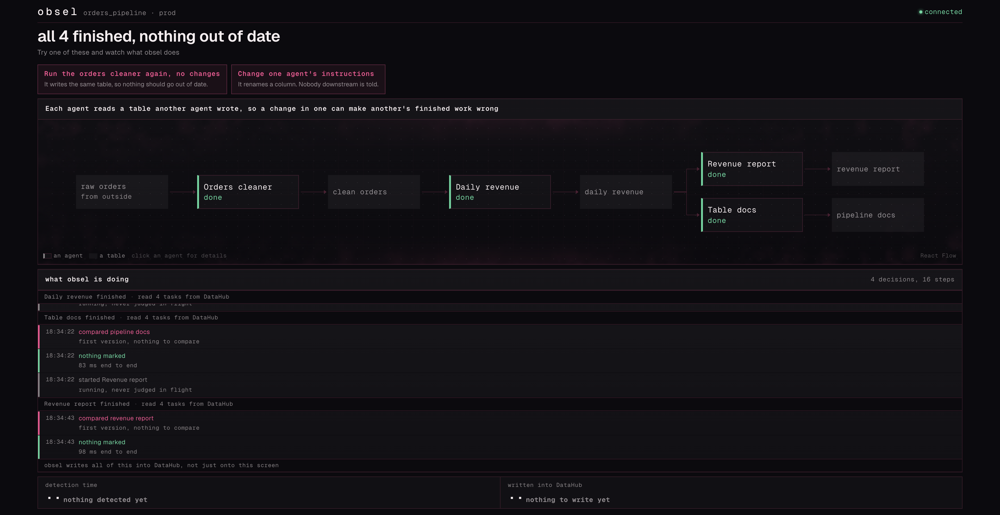
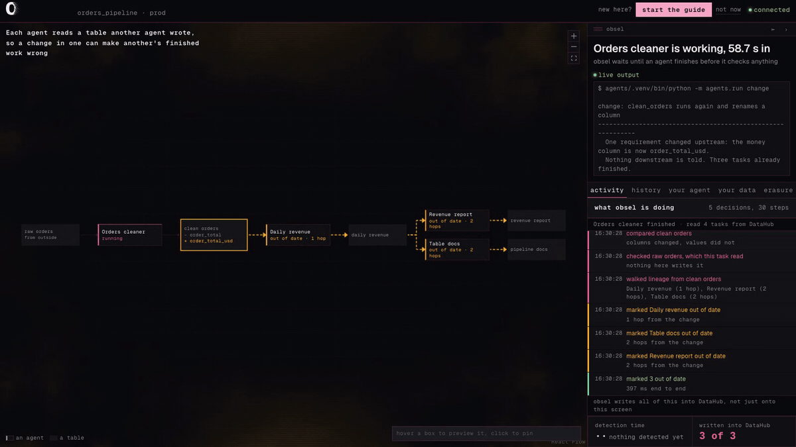
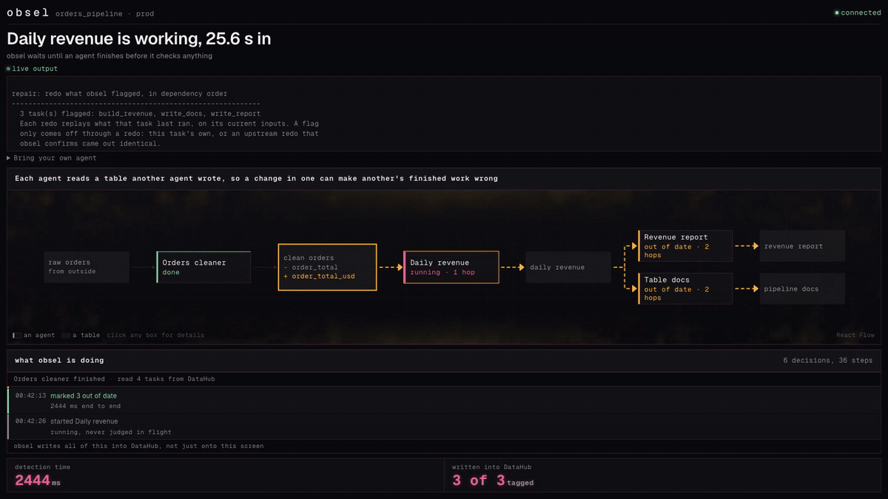

<div align="center">

# obsel

**Several AI agents. One shared set of tables. Somebody has to notice when the ground moves.**

Built for [Build with DataHub: The Agent Hackathon](https://datahub.devpost.com/) &nbsp;·&nbsp;
Category: _Agents That Do Real Work_ &nbsp;·&nbsp; Apache-2.0

[Try it](#try-it) &nbsp;·&nbsp; [Bring your own agent](#bring-your-own-agent) &nbsp;·&nbsp;
[Check the claims](#check-the-claims-yourself) &nbsp;·&nbsp; [Commands](#commands) &nbsp;·&nbsp;
[Docs](#more-reading)

</div>

---

## The problem

Each agent reads a table that another agent wrote.

When one of them changes a table, everyone who already finished downstream is now working from
something that moved. Nothing tells them. Their work sits there saying **complete**.

## What obsel does

> obsel gives every agent task a real entry in DataHub, wired to the data it reads and the data it
> writes. When an output changes, obsel follows those wires and flags every finished task
> downstream, with the reason and the change that caused it.
>
> That includes work which never touched the change itself, only something built on it.

It stays quiet otherwise. A re-run that produces the same table flags nothing at all, which is the
whole reason anybody would trust it the day it does speak up.

## When you should not use this

If one orchestrator owns your pipeline, it can already do this and you should use it instead.
[Dagster](https://docs.dagster.io/guides/build/assets/asset-versioning-and-caching) marks an asset
stale when its upstream data changed and it has not re-run since, and cascades that downstream.
[dbt](https://docs.getdbt.com/docs/deploy/state-aware-about) rebuilds a model when a source has new
data. Neither of them needed obsel to exist.

obsel is for the case those tools do not cover: **nobody owns the graph.** Agents from different
frameworks, on different machines, joining and leaving, with no shared scheduler to ask. Both tools
above need every node declared in a project before it can take part. An agent joins obsel at runtime
by announcing itself, and creates its own node when it does.

The full comparison, including where obsel is genuinely not novel, is in
[docs/concept.md](docs/concept.md#3a-orchestrators-checked-properly-on-2026-07-23).

---

## See it

|                                                                                                        Everything is fine                                                                                                        |                                                                                                                                                  Something changed upstream                                                                                                                                                  |
| :------------------------------------------------------------------------------------------------------------------------------------------------------------------------------------------------------------------------------: | :--------------------------------------------------------------------------------------------------------------------------------------------------------------------------------------------------------------------------------------------------------------------------------------------------------------------------: |
| [](docs/images/settled.png) | [](docs/images/flagged.png) |
|                                                                        Four agents finished. Nothing they read has changed since, so obsel says nothing.                                                                         |                                                                                                        One column was renamed. Three finished agents are now out of date, and **two of them never read that table**.                                                                                                         |

<div align="center"><em>Click either image for full size.</em></div>

Both came out of one run on 2026-07-23, from commit `9bd695e`, against a live DataHub and a live
Codex CLI. Not mockups, and not assembled from separate sessions.

| What happened                                       | Measured                                             |
| --------------------------------------------------- | ---------------------------------------------------- |
| Four agents did the work                            | 206.0 s of real Codex sessions                       |
| One agent's instructions changed                    | `order_total` became `order_total_usd`               |
| obsel called it a column change, not a value change | the content hash was `539b509722e8` before and after |
| Three finished agents flagged                       | 5399 ms, one at one hop and two at two               |
| Written back into DataHub                           | 3 of 3 tagged                                        |

### Watch it move

|                                                                                    The change lands                                                                                     |                                                                                        The way back to green                                                                                         |
| :-------------------------------------------------------------------------------------------------------------------------------------------------------------------------------------: | :--------------------------------------------------------------------------------------------------------------------------------------------------------------------------------------------------: |
|  |  |

One sequence, recorded 2026-07-24 against the same live stack, with that run's own numbers in
frame: the cascade landed in a measured 2444 ms, and the repair redid **one** of the three flagged
tasks, obsel clearing the other two itself because the redone table came out byte-identical. A flag
has no dismiss button. It comes off through redone work, the task's own or what an upstream redo
proves.

---

## Try it

```bash
datahub docker quickstart
cp .env.example .env.local
pnpm install && pnpm dev
```

Open **`http://localhost:3000`**.

The board opens on a checklist, because those three commands are not quite everything. The demo
agents need their own Python packages and a signed-in Codex CLI, and obsel needs its tag registered
in DataHub. Every item is checked on your machine a couple of times a second, finished ones are
ticked, and anything missing shows you the exact command to run. Work down the list and it empties.

After that, the whole demo is buttons.

| Button                                       | What happens                                                                                  |
| -------------------------------------------- | --------------------------------------------------------------------------------------------- |
| **Set up the demo agents**                   | Four agents are added to DataHub. Nothing runs yet.                                           |
| **Start the demo agents**                    | Four real Codex sessions do the work. Two to three minutes.                                   |
| **Run the orders cleaner again, no changes** | The same table comes out, so nothing should go out of date. obsel stays quiet.                |
| **Change one agent's instructions**          | A column gets renamed. Three finished agents go amber, and two of them never read that table. |
| **Redo the work obsel flagged**              | Agents redo it in order. A redo that lands identical clears the flags on work built on it.    |
| **Reset and start over**                     | Everything goes back to up to date. The agents stay set up.                                   |

### What you need

| Thing                | Why                                                                                 |
| -------------------- | ----------------------------------------------------------------------------------- |
| Node 24 and pnpm 11  | the app                                                                             |
| Docker               | the local DataHub stack                                                             |
| Python 3             | the demo agents, which get their own environment                                    |
| `uv`                 | obsel writes its tag through DataHub's own MCP server                               |
| Codex CLI, signed in | each agent is a real Codex session, so there is no offline mode and no API key path |

Every step written out in full, with a way to tell each one worked, is in
**[`docs/setup.md`](docs/setup.md)**.

---

## Bring your own agent

obsel speaks MCP in both directions. It uses DataHub's MCP server to write its tag, and it runs one
of its own, so any MCP-capable agent can join a swarm.

```bash
claude mcp add obsel -- "$PWD/agents/.venv/bin/python" -m agents.mcp_server
```

The board carries this too, under the graph, with your machine's own copy of that command and a
four step checklist that ticks itself off as obsel sees your agent declare itself, announce, report,
and get its first answer. It is derived from the swarm rather than stored, so driving your agent
from a terminal ticks it just the same.

| Tool                                                       | What your agent uses it for                                                        |
| ---------------------------------------------------------- | ---------------------------------------------------------------------------------- |
| `check_freshness(reads)`                                   | before working: are my inputs still trustworthy?                                   |
| `register_task(name, reads, writes, title?, ...)`          | say what I read and what I write, once                                             |
| `announce_start(taskUrn)`                                  | before writing, so work in flight is never flagged                                 |
| `report_complete(taskUrn, outputs, inputs?, runner?, ms?)` | what I produced; obsel replies with what that broke, and with what it proved sound |
| `abandon_task(taskUrn)`                                    | hand the announcement back if I failed                                             |
| `read_board()`                                             | who else is in the swarm, and how they are doing                                   |

Reporting a table is one line: `{"clean_orders": {"path": "data/clean_orders.json"}}`. obsel reads
and hashes the file itself, so no rows travel through the tool call.

Passing `inputs` the same way is how the swarm polices itself. obsel compares what your agent read
against what the writer recorded. If they disagree, that table was changed by something that never
reported, and every finished task built on the old version gets flagged, with the reason saying the
change was never reported. One silent writer cannot hide from the next honest reader.

Two things your agent deliberately cannot do:

- **It never hashes its own output.** `report_complete` takes a file path or the real rows, and
  obsel hashes them itself. An agent that could hand obsel a hash could hand it the _previous_ hash
  and be believed.
- **It cannot flag or unflag anything.** A flag comes off through redone work and nothing else:
  the flagged task re-runs and reports, or a flagged upstream task re-runs, its table comes back
  identical, and obsel clears the flags that redo provably restores. The reply's `restored` list
  is how your agent finds out the second thing happened. It cannot ask for it.

[`skills/obsel-collaboration/SKILL.md`](skills/obsel-collaboration/SKILL.md) teaches an agent the
order that makes obsel's answers mean anything. Copy it into `.claude/skills/` to install it.

### Bring your own data

The same door works for your own files, in a few minutes. Register a task that reads your file and
one that builds on it, report both, change the file, and the downstream task gets flagged with the
reason. Executed for real on 2026-07-24 with a five-row expenses CSV: a renamed column flagged the
totals task at 1 hop in a measured 3934 ms, and the redo cleared it. The copy-paste walkthrough,
with every reply quoted from that run, is in [`docs/setup.md`](docs/setup.md). The full matrix of
shapes, changes and edge cases obsel has been run against is
[`docs/coverage.md`](docs/coverage.md).

---

## Check the claims yourself

Every row is one command away, and names the file that would fail if the claim were false.

| Claim                                                                    | Run                                | Where it lives                                                                      |
| ------------------------------------------------------------------------ | ---------------------------------- | ----------------------------------------------------------------------------------- |
| A re-run producing the same table flags nothing                          | `pnpm test`                        | `tests/staleness.test.ts`, where about half the tests assert no action              |
| Same again, through a real DataHub and through MCP                       | `pnpm test:live`                   | `engine.live.test.ts`, `obsel-mcp.live.test.ts`                                     |
| A change reaches work that never read the table that changed             | `pnpm test:live`                   | `obsel-mcp.live.test.ts` checks one hop and two, each with its reason               |
| Work in flight is never flagged                                          | `pnpm test`                        | `tests/staleness.test.ts`                                                           |
| A flagged task's identical redo clears the flags downstream of it        | `pnpm test:live`                   | `engine.live.test.ts`, and over real stdio in `obsel-mcp.live.test.ts`              |
| That clearing refuses everything it cannot prove                         | `pnpm test`                        | `tests/staleness.test.ts`: the refusal cases lead, each guard pinned by breaking it |
| The `obsel-stale` tag really lands in DataHub, confirmed by reading back | `pnpm test:live`                   | `mcp.live.test.ts`, `obsel-mcp.live.test.ts`                                        |
| `217` and `217.0` are not treated as a change                            | `python3 -m agents.worker`         | and again through MCP in `agents/mcp_core.py`                                       |
| A reply obsel never sent is refused, not read as "nothing was affected"  | `python3 -m agents.run self-check` | breaking that guard fails six checks, and five more in `mcp_core.py`                |
| Any MCP agent can join and set off a real cascade                        | `pnpm test:live`                   | `obsel-mcp.live.test.ts`, with a real client, a dead port, and the wrong server     |
| TypeScript and Python build identical DataHub ids                        | `pnpm test`                        | `tests/urns.test.ts` runs the Python module for real                                |

**Nothing here is tested against a stand-in.** Anything that crosses a process boundary is covered
against a live DataHub, the real MCP server, a real obsel, and a real `codex exec` session.

### What is still open

The full record of what has been measured, and what has not, is in
**[`docs/verification.md`](docs/verification.md)**. The short version:

- The demo has passed cleanly seven times, on one machine. That is not a pass rate.
- Codex is a live agent, and its output has needed pinning down three times.
- Detection times are single observations, not a benchmark, and most forty-task figures are one or
  two observations each.
- The graph has been checked in a real browser on two pipeline shapes, four tasks and forty, plus
  a joined fifth agent in the unit suite. Nothing between or beyond those.
- The submission video is not voiced or uploaded. A measured 157.9 s reference picture lock exists
  from a clean one-shot take, but it predates the joining panel and has to be shot again.

---

## Commands

```bash
pnpm dev         # the cockpit at http://localhost:3000
pnpm verify      # format, lint, typecheck, tests, Python self-checks, build
pnpm test        # pure logic only, no Docker
pnpm test:live   # the real thing; needs DataHub up, and uvx and codex on PATH
pnpm e2e         # browser checks; builds and serves the app itself
```

**`pnpm verify` is the one to run first.** It needs no Docker and no browser download.

Checked 2026-07-26: `pnpm verify` passes end to end, with 373 tests and 183 Python self-checks
across seven modules. `pnpm test:live` passes 94 tests across ten files in 245 s, two of
them real Codex sessions. `pnpm e2e` passes 121 browser checks across two viewports, with one
skipped by design, half of them against a forty-task board recorded off a real run.

---

## Where things live

```
app/                     routing, and the nine HTTP routes
src/features/cockpit/    the board you look at
src/server/coordinator/  the staleness rules, and the part that talks to DataHub
src/server/datahub/      DataHub client, tag writes, id shapes
src/server/runner/       the demo runner behind the buttons
agents/                  the four demo agents, and obsel's own MCP server
skills/                  how an agent should work in a swarm obsel is watching
docs/                    setup, concept, architecture, findings, demo script, verification
examples/                sample outputs, so you can judge them without running anything
tests/                   deterministic tests, no browser and no DataHub
e2e/                     browser checks
```

There is no scheduler, and nothing listening for events. An agent reporting that it finished is what
starts every check obsel does.

---

## More reading

| Document                                                           | What is in it                                                  |
| ------------------------------------------------------------------ | -------------------------------------------------------------- |
| [`docs/setup.md`](docs/setup.md)                                   | Every setup step, with a way to tell each one worked           |
| [`docs/concept.md`](docs/concept.md)                               | What obsel is, and the evidence the problem is real            |
| [`docs/architecture.md`](docs/architecture.md)                     | How the pieces fit, and why each decision was made             |
| [`docs/verification.md`](docs/verification.md)                     | What is built, what is proven, and what is not                 |
| [`docs/coverage.md`](docs/coverage.md)                             | The executed matrix: every shape, change and edge case tested  |
| [`docs/environment-findings.md`](docs/environment-findings.md)     | DataHub behaviour measured directly, including several traps   |
| [`docs/upstream-contributions.md`](docs/upstream-contributions.md) | A DataHub CLI bug found here, root caused, with a proposed fix |
| [`agents/README.md`](agents/README.md)                             | The demo agents, and what each command prints                  |
| [`examples/README.md`](examples/README.md)                         | Sample outputs, and exactly which parts of them are real       |
| [`PREEXISTING.md`](PREEXISTING.md)                                 | The hackathon's pre-existing code disclosure                   |
